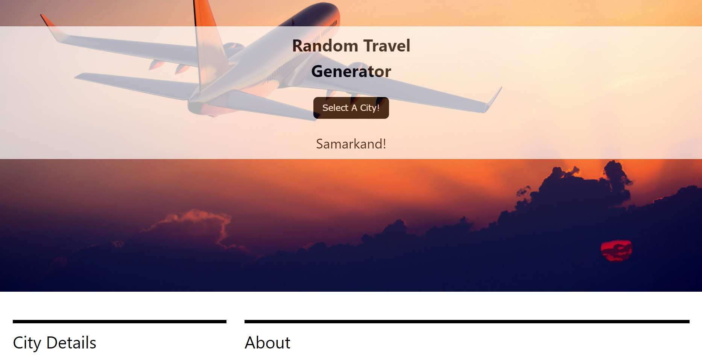

# random-travel-generator

## User Story:
As a user 
I want to explore cities of the world randomly
so that I can visit them.

## Purpose:

To generate useful information about a travel destination. On every button click, 
the users get a city with necessary details. The information and the link give the users
a better tool to make a plan for their next tour.

## Built With
* HTML
* CSS
* Javascript
* API for weather forecast: http://openweathermap.org
* API for city details: http://api.geonames.org
* API for city info: https://en.wikipedia.org.

## Images of the site:

## Website
https://8bitgaming.github.io/random-travel-generator/

## Instructions

The users simply clicks on the button to explore their destination. 
They can use the link to get more information about their city. 
To get the weather information and others
they need to scroll down to the bottom of the page.

## Contribution
* Lauren Smith
* Michele Lee
* Tedd Hauser
* Jeremy Gieske
* Chotan Sharma
